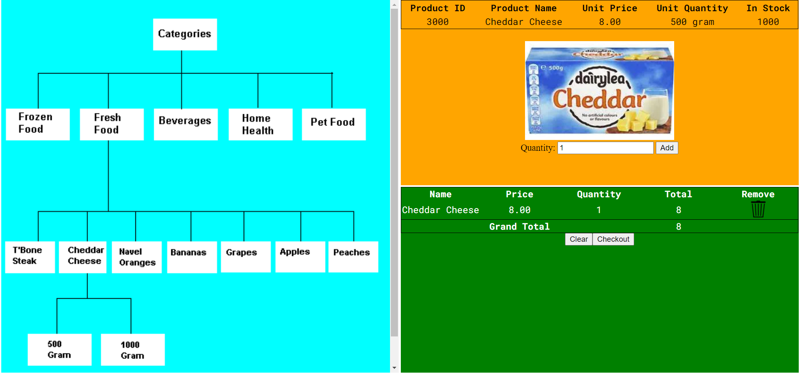

<h1 align="center">31748 Online Grocery Project</h1>
<h5 align="center">23/04/2021</h5>




<h3 align="center">Instructions</h3>
Before deployment make sure to create a `config.php` with the properties of your database.

```
<?php
$DB_URL  = <database url>
$DB_NAME = <database name>
$DB_USER = <database user>
$DB_PASS = <database pass>
?>
```

<h4 align="center">technologies used</h4>
<div align="center">
   
   
   
   
</div>
